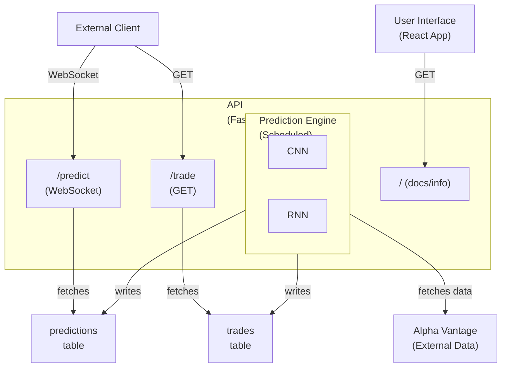

# Candle Whisperer Infrastructure Diagram



# Candle Whisperer API & Frontend

A full-stack project for deploying a Bayesian CRNN Trading Model with Monte Carlo Dropout and quantum layers (TFQ). The backend is a FastAPI service, and the frontend is a modern React app styled with Tailwind CSS and shadcn-ui components.

---

## Table of Contents
- [Project Overview](#project-overview)
- [Requirements](#requirements)
- [Getting Started](#getting-started)
  - [1. Clone the Repository](#1-clone-the-repository)
  - [2. Set Up the Backend (FastAPI)](#2-set-up-the-backend-fastapi)
  - [3. Set Up the Frontend (React)](#3-set-up-the-frontend-react)
- [Development Workflow](#development-workflow)
- [API Documentation](#api-documentation)
- [Contributing](#contributing)
- [License](#license)

---

## Project Overview

**Title:** Deploy Bayesian CRNN Trading Model with Monte Carlo Dropout on Lovable.dev

**Goal:** Build a machine learning API that accepts candlestick pattern image sequences and returns class predictions along with uncertainty, using a Bayesian CRNN model with Monte Carlo Dropout and quantum layers (TFQ).

---

## Requirements

- **Node.js** (v18+ recommended)
- **npm** (v9+ recommended)
- **Python** (3.9+ recommended)
- **pip** (comes with Python)

---

## Getting Started

### 1. Clone the Repository

```sh
git clone <your-repo-url>
cd candle-whisperer-api
```

### 2. Set Up the Backend (FastAPI)

1. **Create and activate a virtual environment:**
   ```sh
   cd backend
   python3 -m venv venv
   source venv/bin/activate
   ```
2. **Install dependencies:**
   ```sh
   pip install -r requirements.txt
   ```
3. **Run the backend server:**
   ```sh
   uvicorn main:app --reload
   ```
   - The API will be available at [http://localhost:8000](http://localhost:8000)
   - Interactive API docs: [http://localhost:8000/docs](http://localhost:8000/docs)

### 3. Set Up the Frontend (React)

1. **Install dependencies:**
   ```sh
   npm install
   ```
2. **Run the frontend app:**
   ```sh
   npm run dev
   ```
   - The UI will be available at [http://localhost:8080](http://localhost:8080) (or the port shown in your terminal)
   - Visit [http://localhost:8080/docs](http://localhost:8080/docs) for usage instructions and API documentation

---

## Development Workflow

- **Create a new branch for your work:**
  ```sh
  git checkout -b <your-feature-branch>
  ```
- **Make your changes and commit:**
  ```sh
  git add .
  git commit -m "Describe your changes"
  ```
- **Push your branch:**
  ```sh
  git push origin <your-feature-branch>
  ```
- **Open a Pull Request** on GitHub to merge your changes.

---

## API Documentation

- **Frontend Docs Page:** [http://localhost:8080/docs](http://localhost:8080/docs)
- **Backend Interactive Docs:** [http://localhost:8000/docs](http://localhost:8000/docs)

### Example Endpoints

- **POST /predict**
  ```sh
  curl -X POST http://localhost:8000/predict \
    -H "Content-Type: application/json" \
    -d '{"input_data": "test value"}'
  ```
- **GET /trade**
  ```sh
  curl http://localhost:8000/trade
  ```

---

## Contributing

1. Create a new branch for your feature or bugfix.
2. Make your changes and commit them with clear messages.
3. Push your branch and open a Pull Request.
4. Ensure your code passes linting and tests (if applicable).

---

## License

MIT
