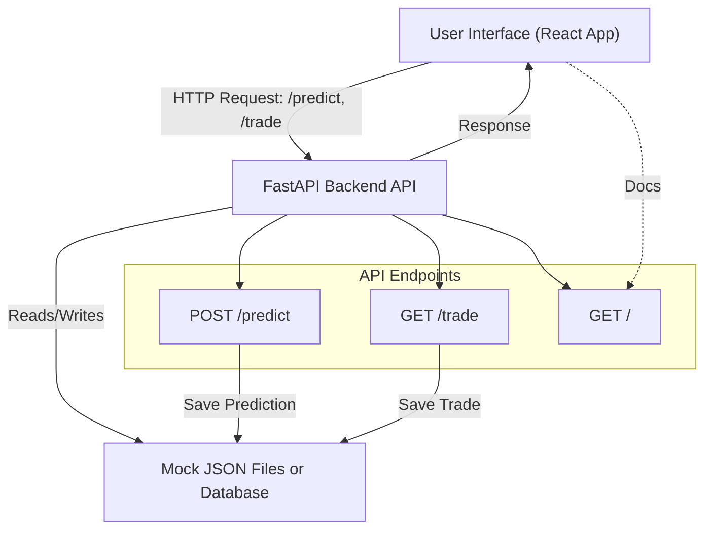

# Candle Whisperer API Backend

This is the backend API for Candle Whisperer, built with Python and FastAPI.

## Infrastructure Diagram



## Setup

1. **Create and activate a virtual environment:**
   ```sh
   python3 -m venv venv
   source venv/bin/activate
   ```

2. **Install dependencies:**
   ```sh
   pip install -r requirements.txt
   ```

## Running the API

```sh
uvicorn main:app --reload
```

- The API will be available at [http://127.0.0.1:8000](http://127.0.0.1:8000)
- Interactive API docs: [http://127.0.0.1:8000/docs](http://127.0.0.1:8000/docs)

## Adding Endpoints
- Edit `main.py` to add your own API endpoints.
- Organize your code as your API grows (e.g., routers, models, services). 