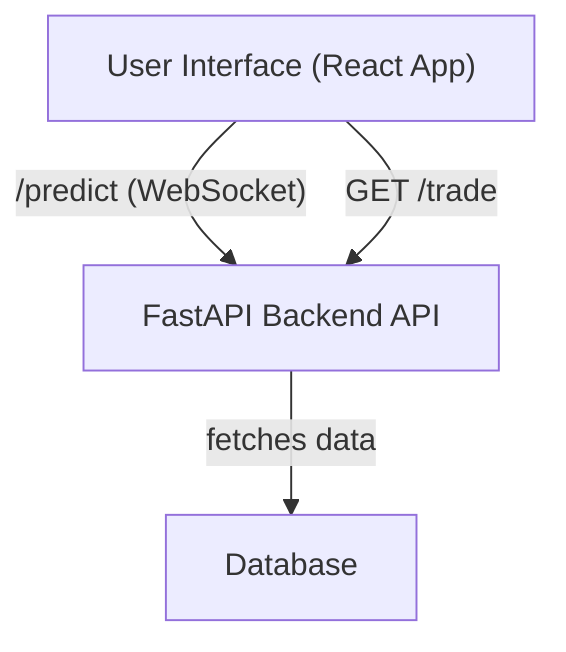

# Candle Whisperer API Backend

This is the backend API for Candle Whisperer, built with Python and FastAPI.

## Real-Time Bayesian CRNN Trading Prediction Engine

The following folders and files are reserved for the real-time prediction engine:

```
backend/
  prediction_engine/           # All logic for the prediction engine
    __init__.py
    cron_job.py                # Entrypoint for scheduled execution
    data/
      __init__.py
      fetch_ohlcv.py           # Fetch OHLCV data from Alpha Vantage
      fetch_fundamentals.py    # Fetch fundamental data from Alpha Vantage
      preprocess.py            # Preprocess data into candlestick images and time series
    model/
      __init__.py
      cnn_lstm.py              # CNN-LSTM + RNN model with Monte Carlo Dropout and TFQ
      predict.py               # Run predictions and uncertainty estimation
    utils/
      __init__.py
      image_utils.py           # Utilities for image processing
      time_utils.py            # Utilities for time series
    storage/
      __init__.py
      save_results.py          # Store outputs (prediction, uncertainty, class, action) in DB
```

- The engine runs on a scheduled cron job (`cron_job.py`).
- Data fetching and preprocessing is handled in the `data/` folder.
- Model logic and prediction is in the `model/` folder.
- Utilities for image and time series processing are in `utils/`.
- Results are stored in the database via the `storage/` folder.

## Infrastructure Diagram



## Setup

1. **Create and activate a virtual environment:**
   ```sh
   python3 -m venv venv
   source venv/bin/activate
   ```

2. **Install dependencies:**
   ```sh
   pip install -r requirements.txt
   ```

## Running the API

```sh
uvicorn main:app --reload
```

- The API will be available at [http://127.0.0.1:8000](http://127.0.0.1:8000)
- Interactive API docs: [http://127.0.0.1:8000/docs](http://127.0.0.1:8000/docs)

## Adding Endpoints
- Edit `main.py` to add your own API endpoints.
- Organize your code as your API grows (e.g., routers, models, services). 